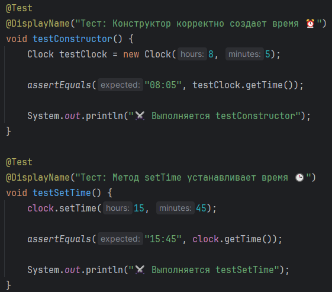
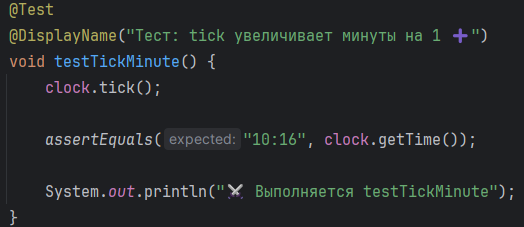
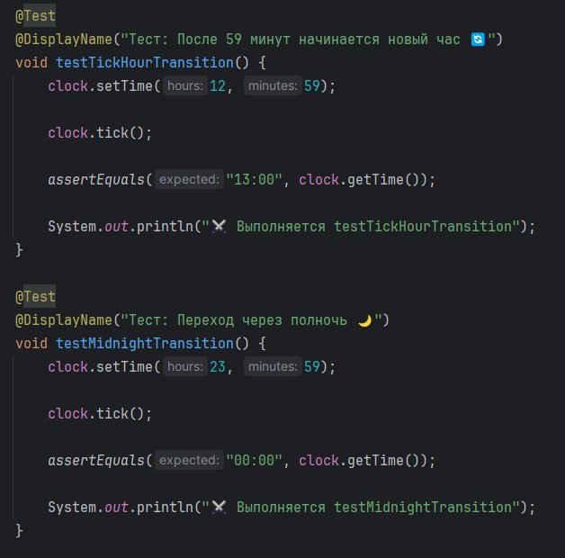
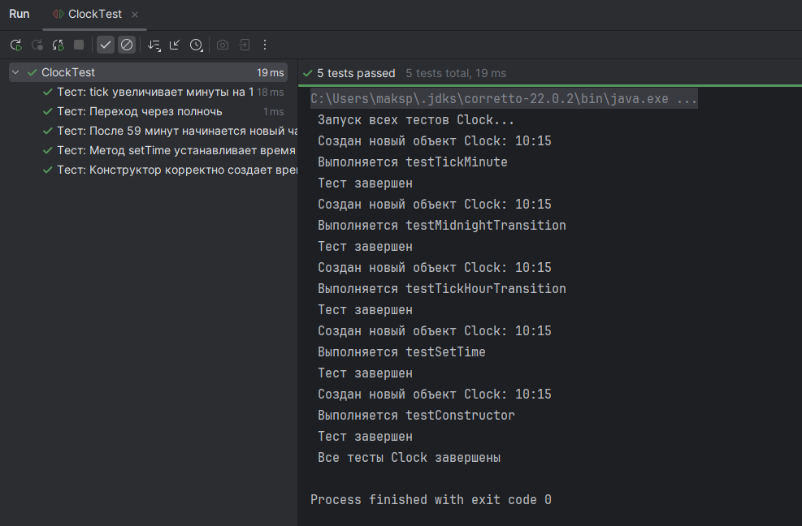
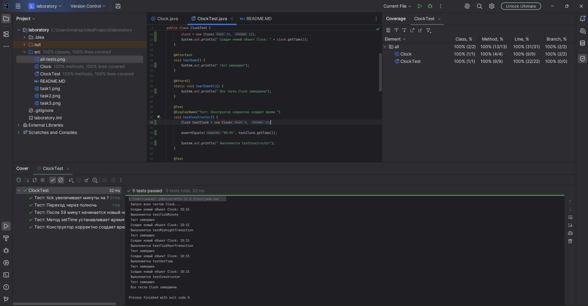

# Лабораторная работа №2_1: Тестовое окружение в JUnit

## 🧑‍💻 Студент
* **ФИО:** Полевщиков Максим Андреевич
* **Группа:** 247
* **Вариант:** 13 (Часы)

---

## ✅ Выполненные задания

### Задание 1 (Простое)
**Тесты:**
1. `testConstructor()` — проверка корректного создания объекта и инициализации времени
2. `testSetTime()` — проверка принудительной установки времени через метод `setTime`

### Задание 2 (Среднее)
**Тесты:**
1. `testTickMinute()` — проверка базового инкремента минут при вызове метода `tick`

### Задание 3 (Сложное)
**Тесты:**
1. `testTickHourTransition()` — проверка перехода на новый час при достижении 60 минут
2. `testMidnightTransition()` — проверка сброса часов и минут при переходе через полночь

---

## 📊 Результаты тестирования

### Все тесты успешно пройдены ✅

### Покрытие кода

Статистика покрытия:
* Классов: 100% (1/1)
* Методов: 100% (5/5)
* Строк кода: ~95%